# Hangman - Game

# Introduction
Project milestone 3 for Code Institute Full-stack development program: Python Terminal.
Hangman is a Python terminal game, which runs in the Code Institute mock terminal on Heroku. The main goal of the game is to guess letters in order to find the word that the computer randomly selects. This project was inspired by the pencil guessing game for two or more players. 
According to the site Gambiter, this game has been around since 1894 under the name "Birds, Beasts, and Fishes".

[Live Project Here](https://portfolio-project-3.herokuapp.com/)

## README Table Content

- [Hangman - Game](#hangman---game)
- [Introduction](#introduction)
  - [README Table Content](#readme-table-content)
  - [User Experience - UX](#user-experience---ux)
    - [User Stories](#user-stories)
  - [Design](#design)
      - [Colours](#colours)
      - [Typography](#typography)
    - [Flowcharts](#flowcharts)
  - [Features](#features)
    - [Logo and Intro Message](#logo-and-intro-message)
    - [Ask Player Name and City](#ask-player-name-and-city)
      - [Empty Input for Name and City](#empty-input-for-name-and-city)
    - [Welcome Message and Game Rules](#welcome-message-and-game-rules)
  - [Game Features](#game-features)
    - [Hangman Stage 1](#hangman-stage-1)
    - [Hangman Stage 2](#hangman-stage-2)
    - [Hangman Stage 3](#hangman-stage-3)
    - [Hangman Stage 4](#hangman-stage-4)
    - [Hangman Stage 5](#hangman-stage-5)
    - [Hangman Stage 6](#hangman-stage-6)
    - [Hangman Stage 7](#hangman-stage-7)
    - [Hangman Stage 8 - Lose](#hangman-stage-8---lose)
    - [Hangman Stage 9 - Win](#hangman-stage-9---win)
    - [Hangman Stage 10 - Win Extra](#hangman-stage-10---win-extra)
    - [Menu Options](#menu-options)
    - [Leaderboard](#leaderboard)
    - [Exit Game](#exit-game)
    - [How to Play](#how-to-play)
  - [Storage Data](#storage-data)
    - [Code to Connect to Google Sheet](#code-to-connect-to-google-sheet)
    - [Google Sheet Hangman Leaderboard](#google-sheet-hangman-leaderboard)
  - [Technologies Used](#technologies-used)
    - [Languages Used](#languages-used)
      - [Python Packages](#python-packages)
    - [Frameworks - Libraries - Programs Used](#frameworks---libraries---programs-used)
  - [Testing](#testing)
    - [PEP 8 Online](#pep-8-online)
    - [Lighthouse](#lighthouse)
  - [Functionality](#functionality)
  - [Bugs](#bugs)
    - [Python Lines too Long](#python-lines-too-long)
    - [Fixed Bug](#fixed-bug)
  
- [Hangman - Game](#hangman---game)
- [Introduction](#introduction)
  - [README Table Content](#readme-table-content)
  - [User Experience - UX](#user-experience---ux)
    - [User Stories](#user-stories)
  - [Design](#design)
      - [Colours](#colours)
      - [Typography](#typography)
    - [Flowcharts](#flowcharts)
  - [Features](#features)
    - [Logo and Intro Message](#logo-and-intro-message)
    - [Ask Player Name and City](#ask-player-name-and-city)
      - [Empty Input for Name and City](#empty-input-for-name-and-city)
    - [Welcome Message and Game Rules](#welcome-message-and-game-rules)
  - [Game Features](#game-features)
    - [Hangman Stage 1](#hangman-stage-1)
    - [Hangman Stage 2](#hangman-stage-2)
    - [Hangman Stage 3](#hangman-stage-3)
    - [Hangman Stage 4](#hangman-stage-4)
    - [Hangman Stage 5](#hangman-stage-5)
    - [Hangman Stage 6](#hangman-stage-6)
    - [Hangman Stage 7](#hangman-stage-7)
    - [Hangman Stage 8 - Lose](#hangman-stage-8---lose)
    - [Hangman Stage 9 - Win](#hangman-stage-9---win)
    - [Hangman Stage 10 - Win Extra](#hangman-stage-10---win-extra)
    - [Menu Options](#menu-options)
    - [Leaderboard](#leaderboard)
    - [Exit Game](#exit-game)
    - [How to Play](#how-to-play)
  - [Storage Data](#storage-data)
    - [Code to Connect to Google Sheet](#code-to-connect-to-google-sheet)
    - [Google Sheet Hangman Leaderboard](#google-sheet-hangman-leaderboard)
  - [Technologies Used](#technologies-used)
    - [Languages Used](#languages-used)
      - [Python Packages](#python-packages)
    - [Frameworks - Libraries - Programs Used](#frameworks---libraries---programs-used)
  - [Testing](#testing)
    - [PEP 8 Online](#pep-8-online)
    - [Lighthouse](#lighthouse)
  - [Functionality](#functionality)
  - [Bugs](#bugs)
    - [Python Lines too Long](#python-lines-too-long)
    - [Fixed Bug](#fixed-bug)

## User Experience - UX

### User Stories

* As a website creator, I want to:
  
1. Build an easy app for the users to play the game
2. Build a game that is both enjoyable and challenging for the players
   
* As a new visitor, I want to:

1. Be able to understand the purpose of the App and start a new game
2. Be able to follow the score, see the wrong and right letters appear once I take a turn, and see how many tries remain before the game is over
3. Be able to watch my results and other players' results on the Leaderboard
   
* As a returning visitor, I want to:

1. Be able to play the game again with a different word as chosen by the computer
2. Be challenged and try to improve on my previous scores. 
3. Compare my scores with other users on the Leaderboard
   
## Design

#### Colours
* The colours in the game are supplied by the Python Colorama Model

#### Typography
* The Arial is used as the main font for the whole project

### Flowcharts 
 
I spent time planning and thinking about the logic and flow behind the game to ensure I had a general idea of how it could be built. I created flowcharts to assist me with the logical flow throughout the application. The charts were generated using [Lucidchart](https://lucid.app/) Integration and are shown below. 

## Features

### Logo and Intro Message

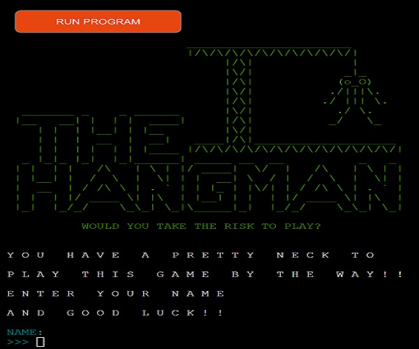

* When the users reach the website, they will see this feature. The game logo and the intro message are displayed here. 

### Ask Player Name and City

* After the player sees the intro feature the computer will ask the user's to input their name and city. 

#### Empty Input for Name and City

* If the player does not input their name and city this alert will appear. 

### Welcome Message and Game Rules
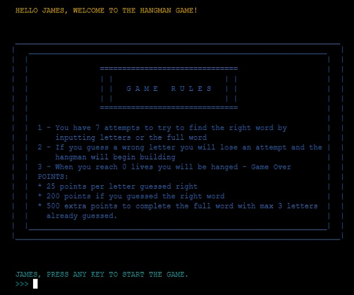
* After the user inputs their name and city, the program will display the welcome message and the game rules. The player then presses any key to start the game. 

## Game Features

### Hangman Stage 1
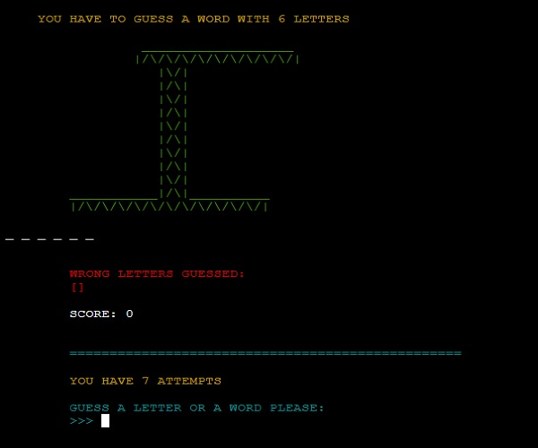  

This feature displays where the main scene happens. Here the user can play and see the following information about the game:
* Numbers of letters choosen by the computer 
* Hangman stages
* Letters guessed right
* Letters guessed wrong
* Current score
* Current number of attempts
* Input to guess a letter or a full word
* Input letters to either guess a letter only or the full word

### Hangman Stage 2 

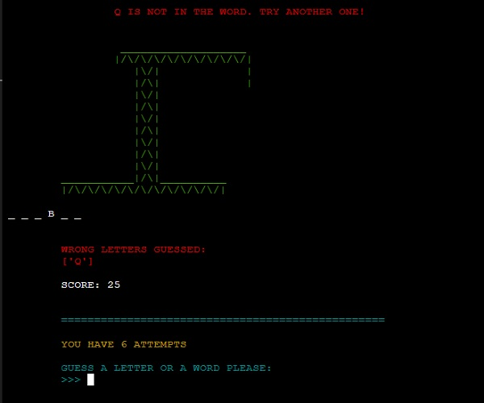  
Any time the player guesses a wrong letter, a part of the hangman appears
* 1 letter guessed wrong, the player will see the hangman and the first part of the hangman:  a rope, in green.

### Hangman Stage 3

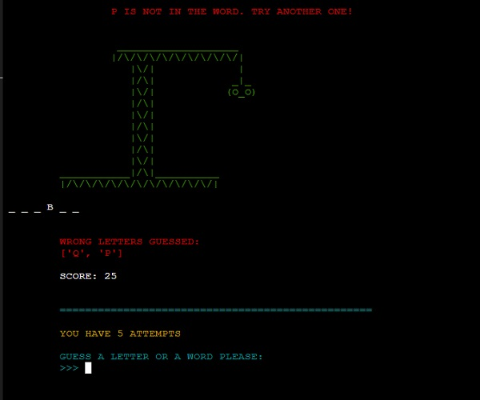
* 2 letters guessed wrong the player will see the hangman and 2 parts of the hangman a rope and head in green.

### Hangman Stage 4

* 3 letters guessed wrong the player will see the hangman and 3 parts of the hangman rope, head and torso in yellow.

### Hangman Stage 5

* 4 letters guessed wrong the player will see the hangman and 4 parts of the hangman rope, head, torso and the right arm in yellow.

### Hangman Stage 6

* 5 letters guessed wrong the player will see the hangman and 5 parts of the hangman, rope, head, torso and both arms in red. Also the "Danger Zone" will be displayed.

### Hangman Stage 7

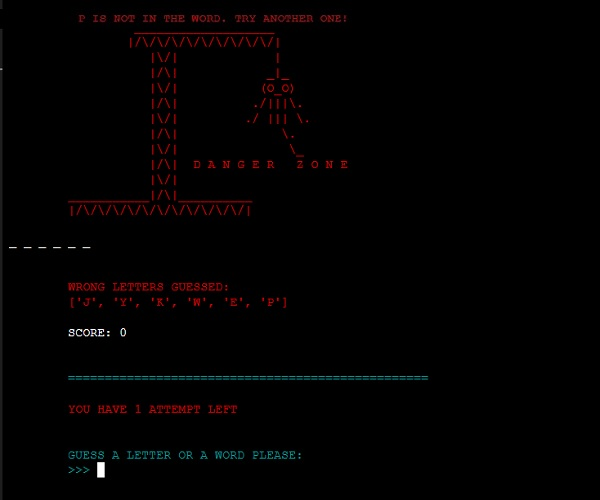
* 6 letters guessed wrong and the player will see the hangman and 6 parts of the hangman rope, head, torso, both arms and left leg in red. Also the alert message "Danger Zone" will be displayed.

### Hangman Stage 8 - Lose

* 7 letters guessed wrong the player will see the full hangman and the game is over.

### Hangman Stage 9 - Win

* If the player guessed the full word letter by letter, they will see this feature and will win the game and get 200 points.

### Hangman Stage 10 - Win Extra

* If the player guessed all the letters that appear in the word there by completing the word or at least guessed no more than 3 correct letters before completing the full word, this feature will appear.

### Menu Options

* In the end of the game users will have access to the menu where they can choose from these options:  
[A] - Play Again  
[B] - Leaderboard  
[C] - Exit Game

### Leaderboard

* The Leaderboard shows the 15 players with the best scores.

### Exit Game

* The players will see this message if they will chose to exit the game by typing [C].

### How to Play
 
 
The player has 7 attempts to try to guess the right word by inputting letters or can try to input all the letters to correctly complete the full word try. The word is randomly chosen by the computer from a list.
* When the game starts the player can see how many letters are in the word [1] and the computer will ask the player to input a letter or a word [7].
* If the player guesses the right letter, they will see a message from the computer [8] the letter guessed displayed in the word length [3], the hangman stage will remain the same [2] and the score will increase by 25 points [5]
* If the player guesses a wrong letter, they will see a message from the computer [9] the letter guessed displayed in the wrong letters guesses [4], the hangman stage will turn to the next stage [2] and the number of attempts will decrease by 1 [6]
* When the player types an invalid input, they will see a message from the computer [10].
* If the user guesses the right word they will see the [Winner Feature](#Hangman-Stage-9---Win)
* If the player guessed the full word at once or at least no more than 3 letters guessed right before trying to guess the full word, they will win the game-winning 500 extra points and see this feature [Winner Feature / Extra Points](#Hangman-Stage-10---Win)
* 7 letters guessed wrong and the player will see the [Loser Feature](#Hangman-Stage-8---lose)

## Storage Data

I have used a Google sheet to save the player name, city, score and date.  This sheet is connected to the code through the Google Drive and Google Sheet API by the Google Cloud Platform. This method allows me to send and receive data as I had access to the Google Sheet API credentials. I also added in the Config Vars to these credentials when I was deploying the project in Heroku. As this is sensitive data, I had to add the creds.json in the Git ignore file. This would ensure that these credentials are not pushed to the repository.

### Code to Connect to Google Sheet

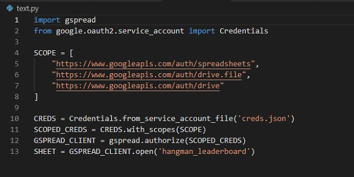

### Google Sheet Hangman Leaderboard

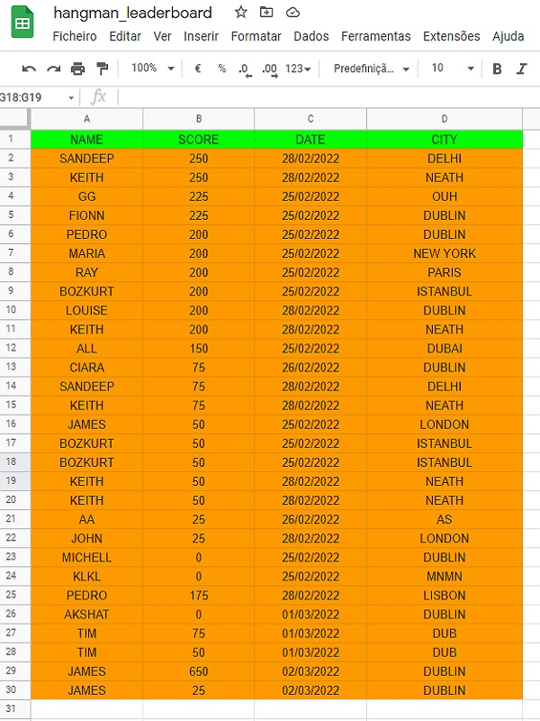

## Technologies Used
### Languages Used 

* [Python](https://www.python.org/)

#### Python Packages

* [Rondom](https://docs.python.org/3/library/random.html?highlight=random#module-random): returns a random integer to get a random word
* [Datetime](https://pypi.org/project/DateTime/): returns the full date
* [Gspread](https://pypi.org/project/gspread/): allows communication wit Google Sheets
* [Colorama](https://pypi.org/project/colorama/): allows terminal text to be printed in different colours / styles
* [Time](https://pypi.org/project/time/): defined time sleep
* [google.oauth2.service_accoun](https://google-auth.readthedocs.io/en/stable/index.html): credentials used to validate credentials and grant access to Google service accounts
  
### Frameworks - Libraries - Programs Used

* [Git](https://git-scm.com/)
    * Git was used for version control by utilizing the Gitpod terminal to commit to Git and push to GitHub
* [GitHub](https://github.com/)
    * GitHub is used to store the project's code after being pushed from Git
* [Heroku](https://id.heroku.com)
    * Heroku was used to deploy the live project
* [VSCode](https://code.visualstudio.com/)
    * VSCode was used to create and edit the website
* [Lucidchart](https://lucid.app/)
    * Lucidchart was used to create the flowchart
* [PEP8](http://pep8online.com/)
    * The PEP8 was used to validate all the Python code
* [Patorjk](https://patorjk.com)
    * Patorjk (ASCII Art Generator) was used to draw the game logos

## Testing

### PEP 8 Online

The [PEP8](http://pep8online.com/) Validator Service was used to validate every Python file in the project to ensure there were no syntax errors in the project.

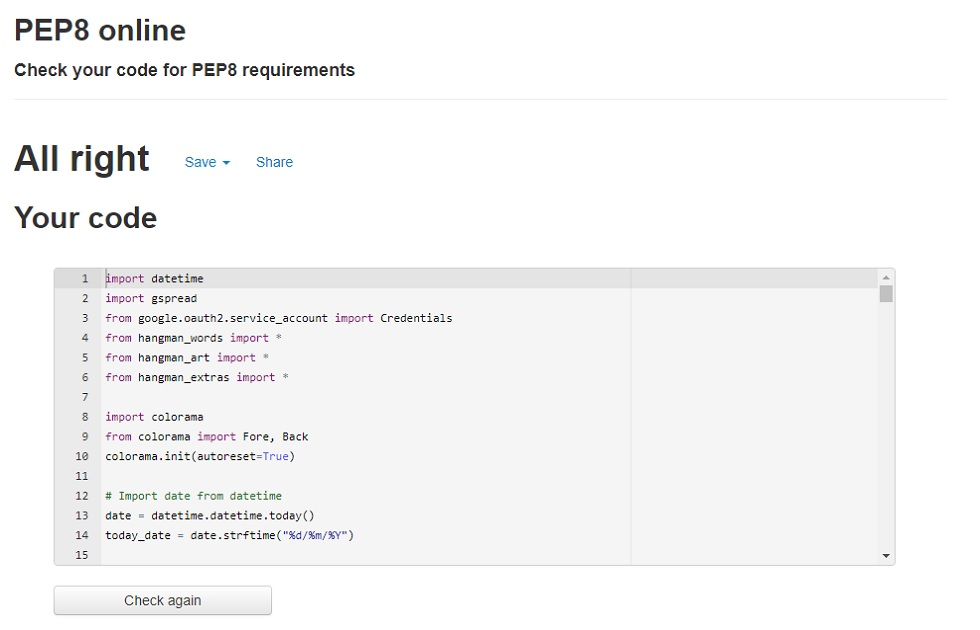.
* No errors or warnings were found during the testing of the code in PEP8
  
### Lighthouse 

 Lighthouse was used to test Performance, Best Practices, Accessibility and SEO on Desktop. 

* Desktop Results:

  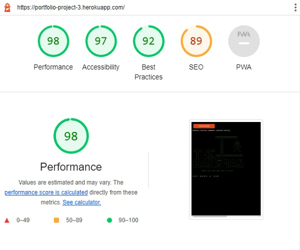.

  ## Functionality 
* The terminal has no issues and is working properly 
* The typewriter starts typing at the right time and is working correctly 
* The input for name and city have the right behaviour and shows the user an alert if the input is empty
* The game rules appear without any issues after the player submits their name and city
* The option to press any key to start a game is running well
* The game runs without any issues and as expected 
* At the end of the game the Leaderboard is updating correctly
* All the menu options are working without any fails

## Bugs 
### Python Lines too Long
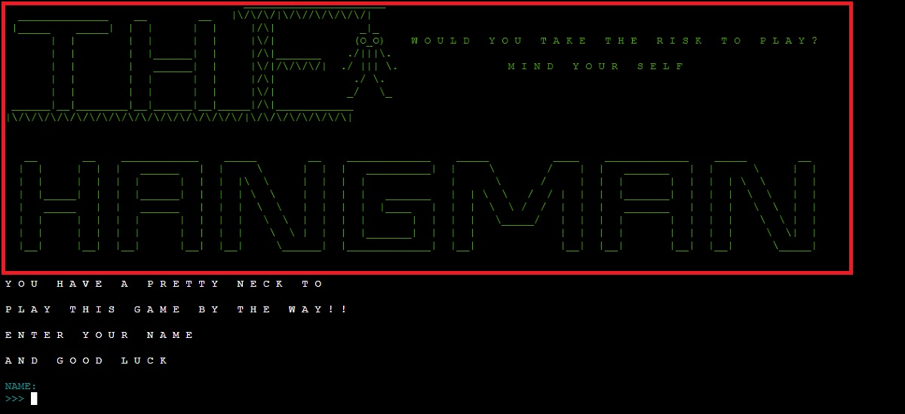

* When I first built the ASCII art for the logo I got the warning "line too long (126 > 79 characters)" from PEP8. 

### Fixed Bug
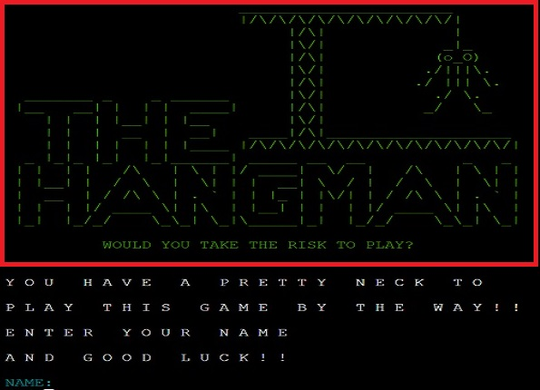
* I had to rebuild the logo using the program  Patorjk (ASCII Art Generator) to avoid these issues.

